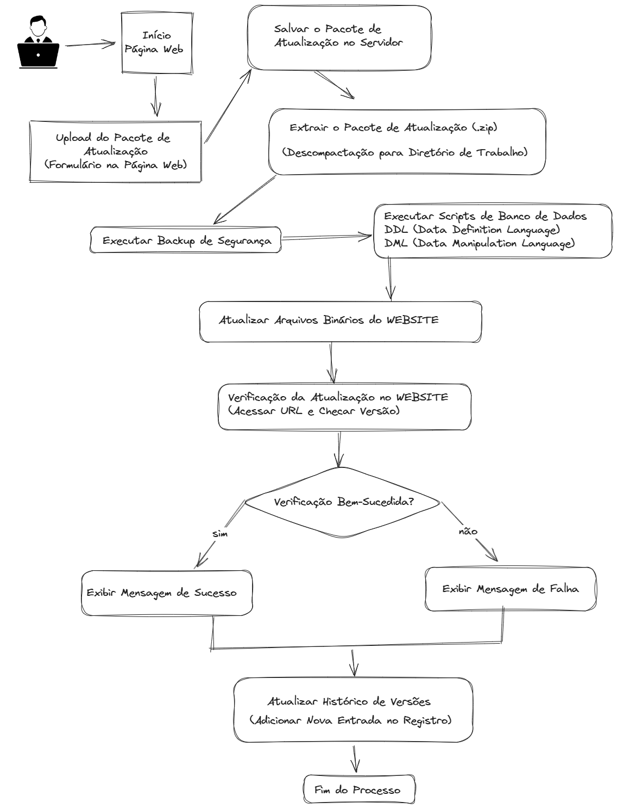

# Automação para o processo de atualização da versão da API.

1. Fazer backup dos dados e arquivos.
2. Executar scripts de banco de dados.
3. Atualizar arquivos binários.
4. Realizar testes e validações.
5. Registrar histórico de versões.

